# Understanding Crime Influence on Real Estate Using Cloud Technologies (GCP + BigQuery ML)

This project studies how crime patterns in U.S. cities relate to the housing market (Home Price **Index NSA**) and also builds a **machine learning model in BigQuery ML** to predict **crime_rate** using city-level features.

---

## Project Goal

- Understand how different crime types (violent crimes, homicides, rapes, assaults, robberies) move with **Index NSA** (home price index).
- Clean the dataset (outliers, nulls, duplicates) so analysis is reliable.
- Train a regression model using **BigQuery ML** and evaluate the results.
- Explain which features are most important using **ML.GLOBAL_EXPLAIN**.

---

## Tech Used

- **Google BigQuery** (data storage, SQL analysis, quick exploration)
- **BigQuery ML** (train, evaluate, predict, explain the ML model)


---

## Dataset

- **Source:** Kaggle  
- **Link:** https://www.kaggle.com/datasets/sandeep04201988/housing-price-index-using-crime-rate-data/  
- Crime data is based on FBI Uniform Crime Reporting (as mentioned in the dataset description).


### Key Columns (high level)

- `Year`
- `City__State`
- `Population`
- `Violent_Crimes`
- `Homicides`
- `Rapes`
- `Assaults`
- `Robberies`
- `index_nsa` (Home Price Index - NSA)
- `crime_rate` (crime rate metric from/derived in the dataset)

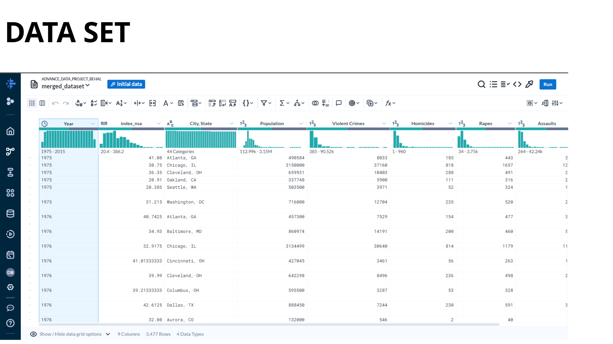

---

## What is Index NSA?

Index NSA is the **U.S. National Home Price (NSA) Index**. It tracks changes in home prices over time.

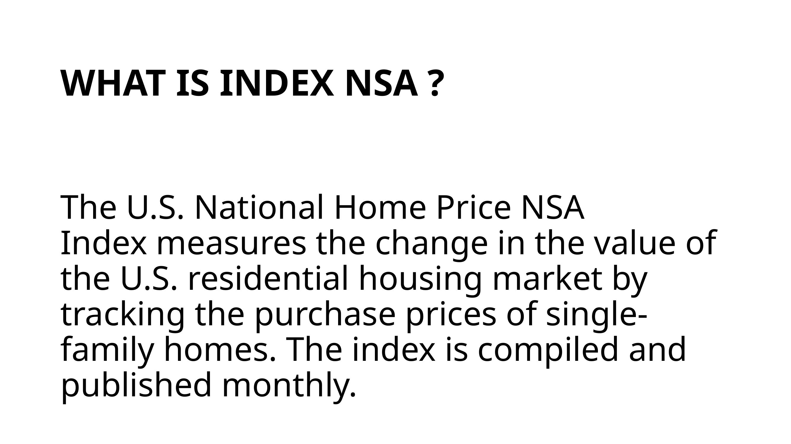

---

## Data Cleaning Steps

### 1) Outlier check
I inspected the data and handled outliers so they don’t distort the analysis.

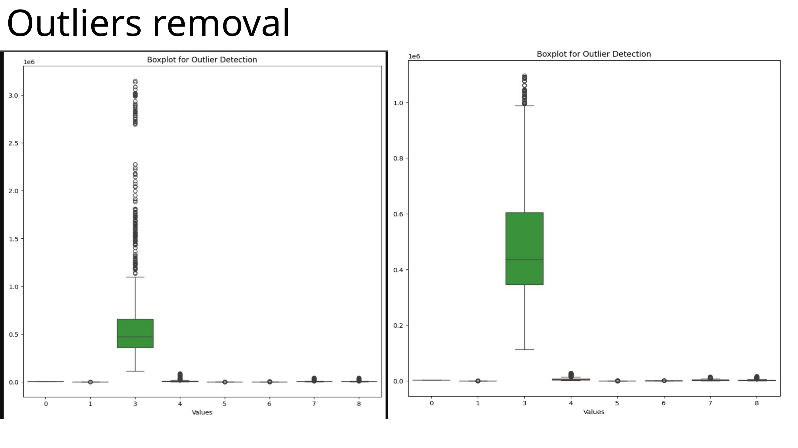

### 2) Null values
I checked missing values and removed rows with nulls to keep the dataset clean.

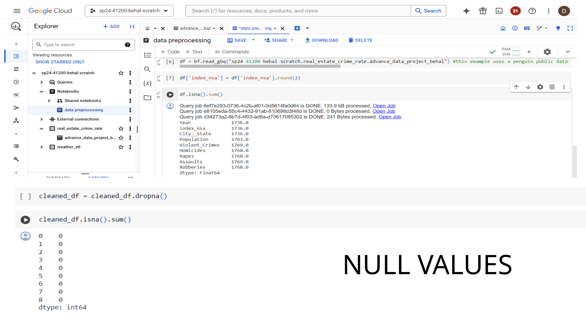

### 3) Duplicate check
I checked and removed duplicate rows to avoid repeating the same records.

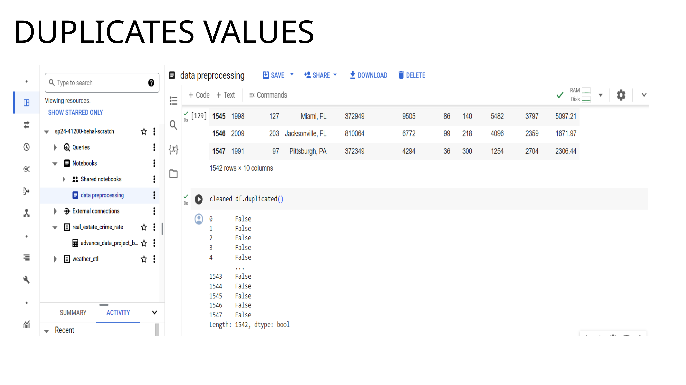

---

## Exploratory Data Analysis (EDA)

### Relationship between crime and Index NSA
These scatter plots show how **Index NSA** relates to different crime types.

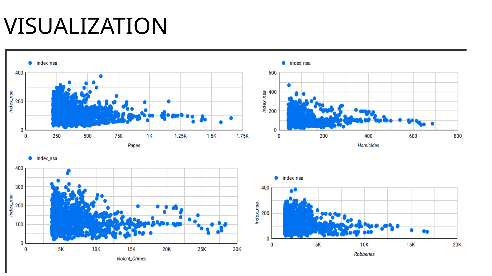

### Top cities by crime_rate (aggregated)
This chart highlights cities with high overall crime_rate (when grouped/combined).

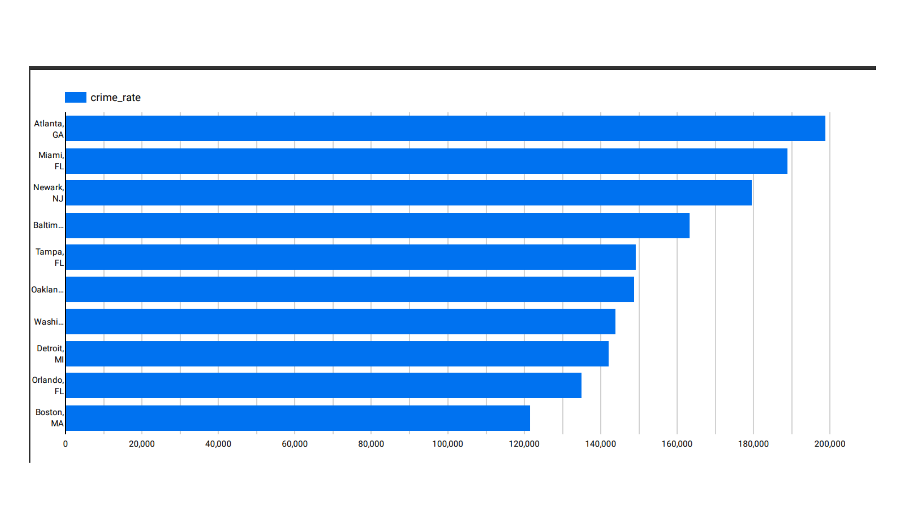

### crime_rate trend over time
Shows how crime_rate changes across years.

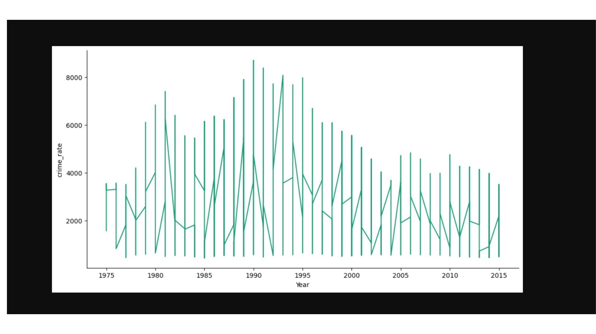

### Index NSA trend over time
Shows how the housing index changes across years.

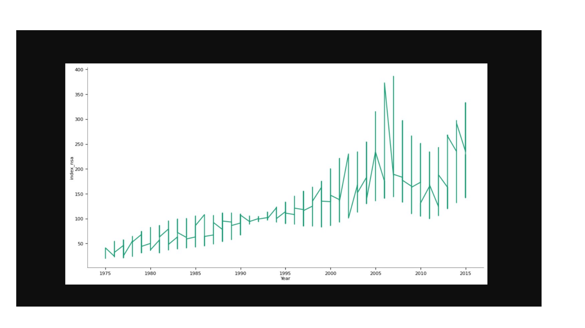

---

## Machine Learning with BigQuery ML

### Training dataset
I created a training table in BigQuery with features like city, population, crime counts, and index_nsa, and used `crime_rate` as the label.

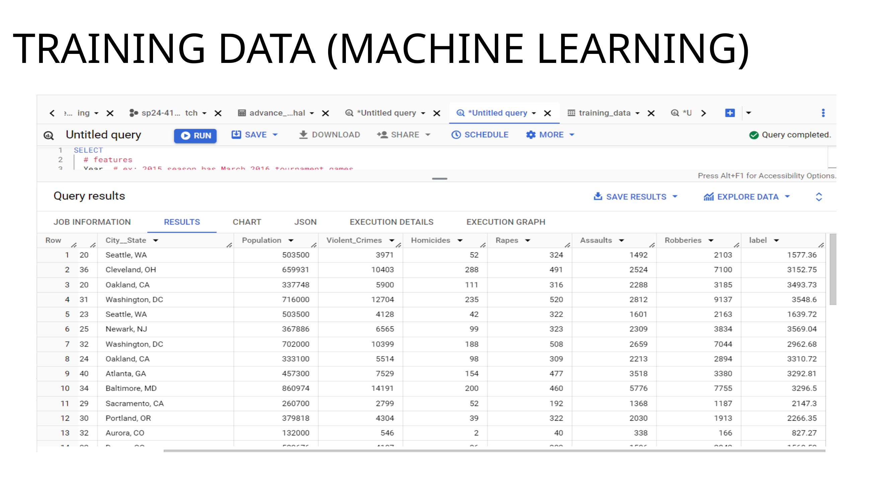

### Model predictions
I used **ML.PREDICT** to generate predictions and compare them with the actual crime_rate.

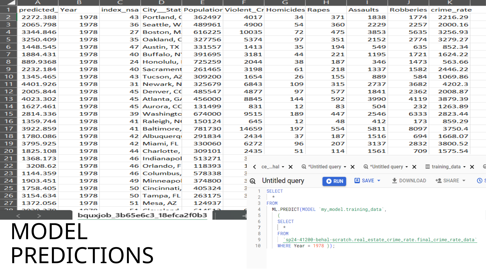

### Feature importance (Explainability)
Using **ML.GLOBAL_EXPLAIN**, I checked which inputs influence predictions most.

Main signals seen in the explain output:
- `City__State`
- `Violent_Crimes`
- `Population`
- `Assaults`
- `Homicides`
- `Robberies`
- `index_nsa`

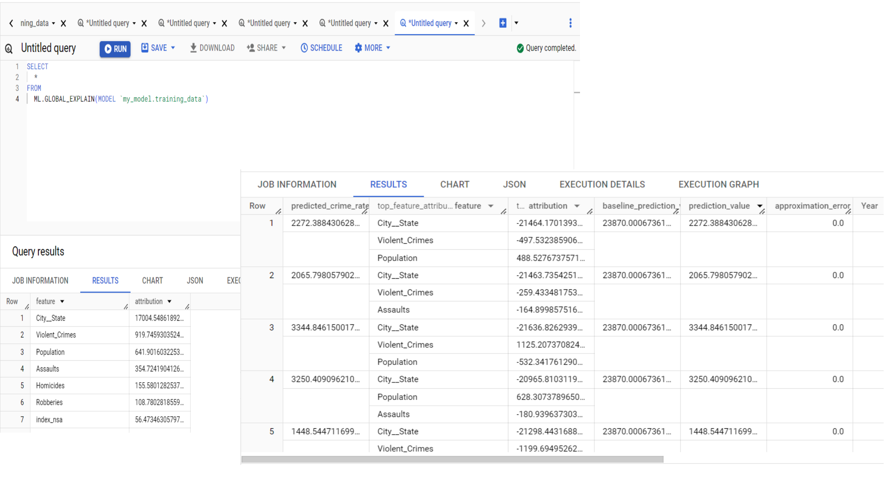

---

## Model Evaluation Results

BigQuery ML evaluation scores:

- **Mean absolute error (MAE):** 235.7153  
- **Mean squared error (MSE):** 124,680.2734  
- **Mean squared log error (MSLE):** 0.0483  
- **Median absolute error:** 152.9471  
- **R squared (R²):** 0.9461  

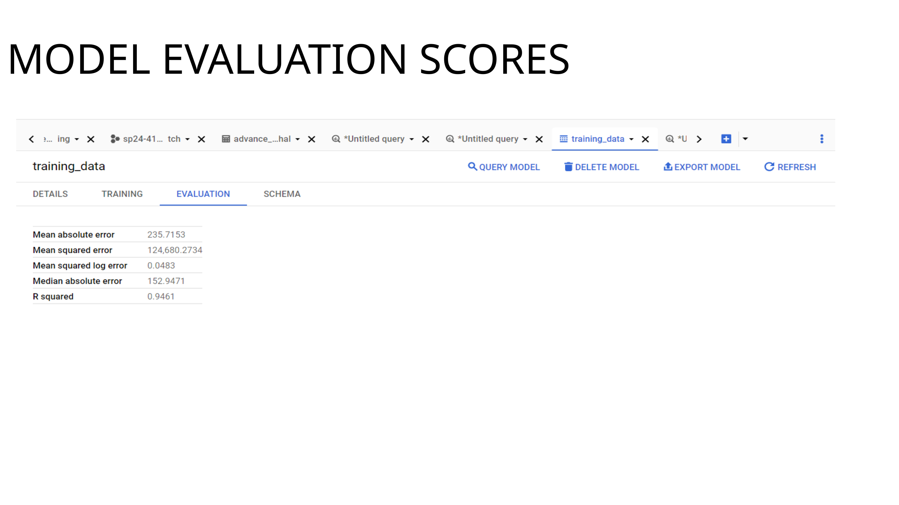

---

## Example BigQuery ML SQL (template)

> Update dataset/table names to match your GCP project.

### Train a regression model
```sql
CREATE OR REPLACE MODEL `your_dataset.crime_rate_model`
OPTIONS(
  model_type = 'linear_reg',
  input_label_cols = ['crime_rate']
) AS
SELECT
  Year,
  index_nsa,
  City__State,
  Population,
  Violent_Crimes,
  Homicides,
  Rapes,
  Assaults,
  Robberies,
  crime_rate
FROM `your_dataset.final_crime_rate_data`;
